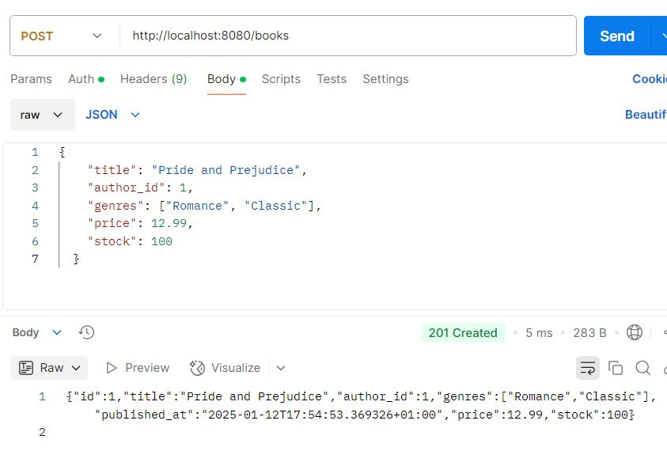
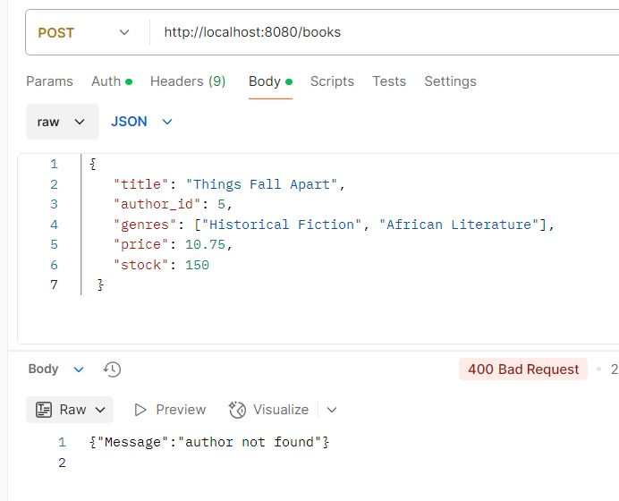
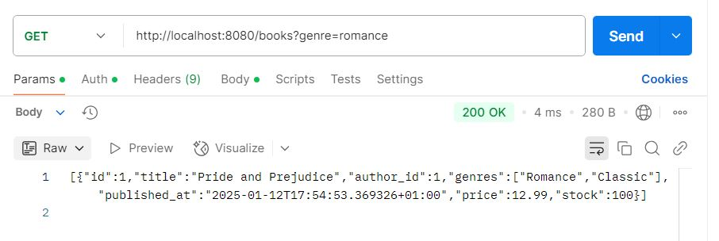
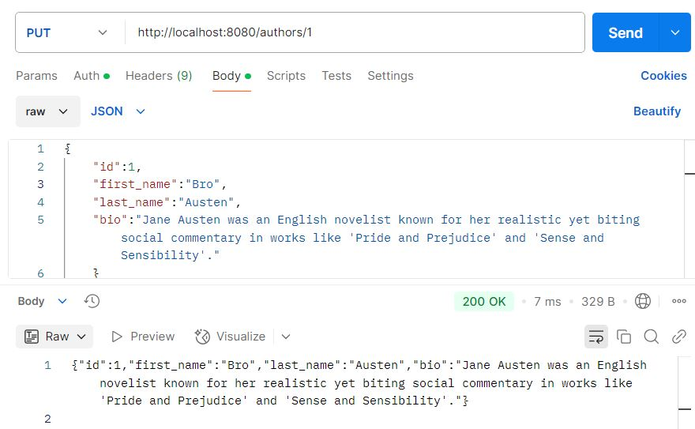
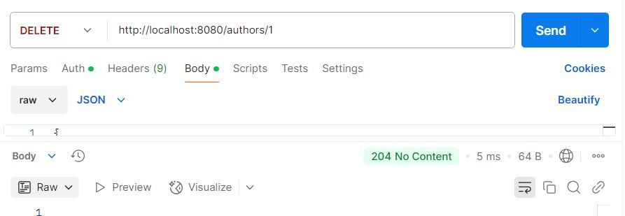
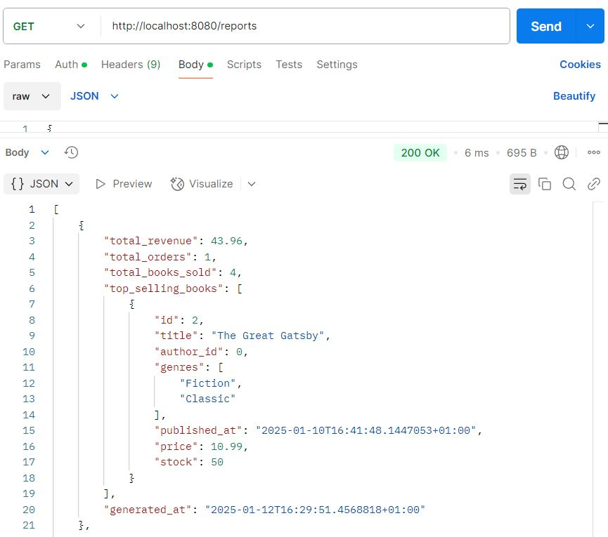
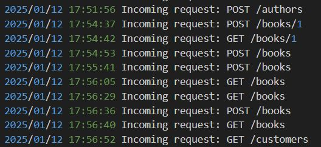

# Biblios App

## Overview
A Go-based service providing basic CRUD operations for Books, Authors, Customers, Orders, and automatic Sales Reports.

## Collaborators
- Abdelghafour Mourchid
- Yassine Blali

## Roadmap for Future Enhancements 🚀

This application is designed to grow and evolve! Below are the planned improvements to enhance its performance, reliability, and scalability:

### 1. **Implementing PostgreSQL**  
   Transition from in-memory storage PostgreSQL for persistence, scalability, and data integrity.

### 2. **Adding Proper Error Handling**  
   - Ensure all errors are consistently captured and logged.  
   - Provide clear and user-friendly error responses via the API.

### 3. **Implementing Authentication and Authorization**  
   - Secure the application with user authentication, using JWT-based login.  
   - Introduce role-based access control for specific endpoints and operations.

### 4. **Adding Input Validation**  
   - Validate all incoming requests to ensure data consistency and security.  
   - Prevent invalid or malicious data from entering the system.

### 5. **Implementing Caching (Using Redis)**  
   - Optimize API performance by caching frequently accessed data.  
   - Reduce database load for repeated queries.

### 6. **Adding Comprehensive Testing**  
   - Develop unit, integration, and end-to-end tests to verify application reliability.  
   - Achieve high test coverage across all features and modules.

### 7. **Containerizing the Application Components Using Docker**  
   - Dockerize the API and database for consistent and portable deployments.  
   - Use `docker-compose` for orchestrating multiple containers.

### 8. **Setting Up a CI/CD Pipeline (Using GitHub Actions)**  
   - Automate build, test, and deployment processes for faster iteration cycles.  
   - Ensure code quality with automated linting and testing.

### 9. **Implementing Monitoring and Logging**  
   - Use tools like Prometheus and Grafana to monitor application performance and health.  
   - Maintain detailed logs for debugging and analytics.

### 10. **Adding Rate Limiting**  
   - Protect the application from abuse by limiting the number of requests a client can make within a specific time window.

### 11. **Implementing Database Migrations (Using Flyway)**  
   - Introduce a robust migration strategy to manage database schema changes over time.  
   - Ensure smooth upgrades and backward compatibility for existing data.

---

### Stay Tuned! 🚧  
These updates will be rolled out incrementally, making the application production-ready and adaptable to real-world scenarios. If you’re curious about progress or would like to contribute, feel free to reach out or explore the repository!

## How to Run
1. Install Go 1.23.4 or higher.
2. Run `go mod tidy` to install dependencies.
3. Run `go run api/bookstore.go`.
4. The server listens on port 8080 by default.

## Endpoints

### Books
- **POST /books** — Create a book.  
- **GET /books** — List/search books.  
- **GET /books/{id}** — Get a single book.  
- **PUT /books/{id}** — Update a book.  
- **DELETE /books/{id}** — Delete a book.

### Authors
- **POST /authors** — Create an author.  
- **GET /authors** — List/search authors.  
- **GET /authors/{id}** — Get a single author.  
- **PUT /authors/{id}** — Update an author.  
- **DELETE /authors/{id}** — Delete an author.

### Customers
- **POST /customers** — Create customer.  
- **GET /customers** — List/search customers.  
- **GET /customers/{id}** — Get a single customer.  
- **PUT /customers/{id}** — Update a customer.  
- **DELETE /customers/{id}** — Delete a customer.

### Orders
- **POST /orders** — Create an order.  
- **GET /orders** — List/search orders.  
- **GET /orders/{id}** — Get a single order.  
- **PUT /orders/{id}** — Update an order.  
- **DELETE /orders/{id}** — Delete an order.

### Reports
- **GET /reports** — Aggregate and return all JSON sales reports.

## Usage Steps
1. Start the server.  
2. Use any REST client (e.g., cURL or Postman).  
3. Send HTTP requests to the endpoints above.  
4. Check generated JSON files in the `./reports` folder for daily sales reports.

### Additional Features

#### 1. **Periodic Sales Report Generator**
- The application includes a periodic background task that runs every 24 hours.
- This task aggregates sales data, generating a JSON report with the following details:
  - **Total Revenue**: The sum of all sales within the last 24 hours.
  - **Total Orders**: The total number of orders placed.
  - **Total Books Sold**: A cumulative count of books sold.
  - **Top-Selling Books**: A list of books with the highest sales during the period.
- Each report is saved in the `reports` directory with filenames in the format `report_YYYYMMDD_HHMM.json`.
- The sales report generation runs in the background, ensuring it doesn’t interfere with the main API responsiveness.

#### 2. **Logging**
- A comprehensive logging mechanism has been implemented to:
  - Record API requests and responses.
  - Log significant events such as order placements and the execution of background tasks.
  - Capture errors, including failed requests and system anomalies.
- Logs are stored in the `api.log` file with timestamps for easy debugging and monitoring.

#### 3. **Manual Testing (Postman as a client)**
Below are some examples of tests I have done using Postman
- **Create a Book**
  - **Endpoint**: `POST /books`
    - 
    - 
  - **Endpoint**: `GET /books?genre=romance`  
    - 
  - **Endpoint**: `PUT /authors/1`  
    - 
  - **Endpoint**: `DELETE /authors/1`  
    - 
  - **Endpoint**: `GET /reports`  
    - 

 

- **Test Logging**

  - 

